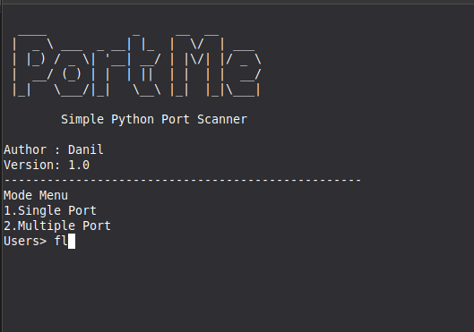
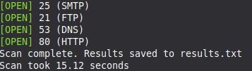

# Port Me

Simple Python Port Scanner built with Python sockets and threading.



## Features

- Single port scan
- Multi-port scan
- Service detection
- Threading support
- File logging
- Hostname validation
- Port validation
- Scan summary

## Example


## Requirements

Python 3

## How To install
```bash

cd Port-Me
python3 portme.py
```

## Run

```bash
python3 portme.py

